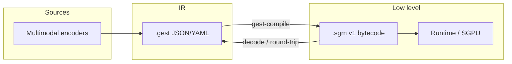

# .gest — gesture intermediate representation

**`.gest`** is a **non-semantic**, machine-oriented format for human-like motion: 3D poses, trajectories, discrete body states, and a timeline. It sits between high-level gesture descriptions (intent, dialogue, glosses) and low-level **`.sgm`** bytecode intended for runtimes (avatars, XR clients, robotics stacks, or custom “gesture GPUs”).

It is **not** a sign language or natural-language encoding: there are no glosses, lexical entries, or free-text semantics on the execution path. That separation matters whenever motion must be **audited**, **versioned**, or **shipped** independently of meaning-bearing labels.

The sections below spell out **why teams adopt it**, **where it shows up in production**, and **how the CLI/API** support those paths end to end.

---

## Why use it?

| Goal | How `.gest` helps |
|------|-------------------|
| **Stable interchange** | JSON (canonical for validation) and YAML share the same tree; JSON Schema locks the shape. |
| **Stronger than schema alone** | IR **invariants** check stride × joint counts, `state_index` bounds, direction vectors, and `values` / `blob_ref` exclusivity. |
| **Execution path** | **`gest-compile`** emits little-endian **SGM v1** bytecode with a documented opcode layout and a **C header** for other language ports. |
| **Round-trip debugging** | Decode bytecode, dump ops, or rebuild a **draft** `.gest` document for diffing and tests. |
| **Policy-friendly motion logs** | Same clip can be validated once, then compiled for embedded use while semantics stay in systems you already govern (EMR, CMS, study DB). |

---

## Architecture (high level)



---

## Real-world use cases

The format is deliberately **geometric and temporal**: you can standardize *how* motion is stored and replayed without baking in *what it means* linguistically. Below are situations teams often hit, and how `.gest` / this toolchain fits.

### 1. XR, games, and live hand / body streams

**Problem:** You have 60–90 Hz tracking (hands, head gaze, optional face blendshapes) from a headset or depth camera. You need a file format for **clips**, **network deltas**, or **QA replays** that stays stable across engine versions and does not accidentally embed chat text or UI strings.

**How `.gest` helps:** One tree describes `fps`, coordinate conventions, named channels, and a `timeline` of poses. You validate **before** import so broken stride lengths or out-of-range discrete states fail in CI, not at runtime.

**Typical flow:**

1. Your sensor stack writes JSON or YAML (or you convert from proprietary CSV/binary in a small adapter).
2. `gest-validate recording.gest.yaml` in CI.
3. `gest-compile recording.gest.yaml assets/clip_042.sgm` for a device or engine loader that consumes bytecode.

**Concrete starting point:** copy [`examples/minimal.gest.yaml`](examples/minimal.gest.yaml) — it validates end-to-end. To scale up to a **dense hand** track, keep `len(joints.values) == joint_count * joint_value_stride` (e.g. 21×3 = **63** floats per frame for translation-only joints, or 21×7 = **147** if you encode rotation per joint). For huge sessions, keep the same rule but move payload bytes into a `blobs` entry and reference them with `blob_ref` (described in [`spec/gest-spec.md`](spec/gest-spec.md)).

`state_index` always points into **your** closed `state_enum` list — machine codes like `open` / `pinch_a` in the sample — not free-form sentences.

---

### 2. Animation pipelines, mocap, and “data janitor” gates

**Problem:** Studios receive mocap from multiple vendors. Joints counts, frame rates, and Euler vs quaternion conventions diverge. Someone merges a take where **state_index** points past the enum table — the shot looks fine in Maya until a specific frame crashes the exporter.

**How `.gest` helps:** JSON Schema catches structural nonsense; **invariants** catch `len(values) != joint_count * stride`, bad `dir` length, and conflicting `values` + `blob_ref`. That is ideal for a **pre-publish** or **nightly ingest** job.

**Typical flow:** Exporter DCC script → `.gest` JSON → `gest-validate` in Jenkins / GitHub Actions → only then FBX or engine-specific export.

---

### 3. Robotics, teleoperation, and prosthetics research

**Problem:** You log end-effector poses, gaze, or low-DOF hand postures for **replay**, **imitation learning**, or **safety audit**. Regulators and ethics review boards care that patient diaries or spoken commands are **not** mixed into the same binary stream as control trajectories.

**How `.gest` helps:** The execution-oriented document stays **non-semantic**. Provenance, consent text, and clinical notes live in **separate** systems (or `producer_notes` if you accept that it is off the hot path — see the spec). The motion file stays a motion file.

**Typical flow:** ROS / Python logger builds a dict matching the schema → write `.gest.json` → `gest-compile` for a real-time executor that only understands `.sgm`.

---

### 4. Machine learning datasets and benchmarks (motion without gloss leakage)

**Problem:** You distribute a **pose** benchmark inspired by sign-like motion, but you do **not** want trainable models to read text labels from the same artifact as the kinematics (leakage, licensing, or IRB constraints).

**How `.gest` helps:** Keep **kinematics + time** in `.gest`; keep glosses / translations / participant metadata in a **sidecar** CSV or database keyed by clip id. Reviewers see a clear separation.

**Typical flow:** Dataset release contains only `.gest` or `.sgm` + a redacted manifest → researchers who need semantics join via an approved process.

---

### 5. Communication aids and rehabilitation products (motion logging)

**Problem:** An app records practice sessions for **movement quality** (smoothness, range, synchrony between hands). Product wants JSON for analytics dashboards; embedded firmware wants compact bytecode.

**How `.gest` helps:** Same logical clip: validate once, compile for firmware, keep JSON for cloud analytics. Optional `profile: rt` in the spec is a natural direction for smaller, streaming-oriented payloads later.

**Typical flow:** Mobile app POSTs `.gest` JSON → server `gest-validate` → archive + `gest-compile` for device sync.

---

### 6. Debugging “it only fails on device”

**Problem:** QA has a `.sgm` that misbehaves on hardware but you cannot diff it visually.

**How this repo helps:**

```bash
gest-dump-sgm repro.sgm | less          # human-readable ops + timeline
gest-sgm-to-gest repro.sgm draft.json   # draft .gest for diffing against golden files
```

That shortens the loop between **runtime artifact** and **something editors and Git understand**.

---

### What `.gest` is not a substitute for

- **Natural language or sign gloss annotation** — use separate corpora or databases.
- **High-level behavior trees** — use your game AI / planner; `.gest` is closer to animation curves + rig samples.
- **Physics or collision** — not in scope; add your engine’s own layer after playback.

---

## Document model (v0.2)

Roughly, a file contains:

1. **Metadata** — `version`, `fps`, `time_base`, `units`, `coordinate_system`, optional `profile` / `capabilities`.
2. **Space** — named **anchors** (transform hierarchy) and **named_points** in parent frames; quaternions are `xyzw` in JSON.
3. **Channels** — typed streams (`articulated`, `direction`, `blendshape_set`, `scalar`, …) with topology hints (e.g. `joint_count`, `joint_layout`, optional `joint_value_stride` of **3** or **7** floats per joint).
4. **Timeline** — ordered frames with `t` and a **pose** subtree (subset of channels); joints may use inline `values` or `blob_ref` into a root `blobs` table.

Authoritative detail: **[`spec/gest-spec.md`](spec/gest-spec.md)**. Machine validation: **[`schema/gest-0.2.schema.json`](schema/gest-0.2.schema.json)**.

---

## Repository layout

| Path | Role |
|------|------|
| [`spec/gest-spec.md`](spec/gest-spec.md) | Human-readable specification (v0.2) |
| [`schema/gest-0.2.schema.json`](schema/gest-0.2.schema.json) | JSON Schema (Draft 2020-12) |
| [`include/sgm_v1.h`](include/sgm_v1.h) | C macros for SGM v1 magic, kinds, opcodes |
| [`src/gest/sgm_constants.py`](src/gest/sgm_constants.py) | Same constants in Python (**must match** the header; enforced by tests) |
| [`examples/minimal.gest.json`](examples/minimal.gest.json) | Minimal valid example (JSON) |
| [`examples/minimal.gest.yaml`](examples/minimal.gest.yaml) | Same example (YAML) |
| [`src/gest/`](src/gest/) | Loaders, validation, compile / decode / lossy recovery |

---

## Installation

This repo installs the **`gest-ir`** package (local editable install is typical during development):

```bash
cd gest   # root of this repository
python -m venv .venv && source .venv/bin/activate   # Windows: .venv\Scripts\activate
pip install -e ".[dev]"
```

| Extra | Purpose |
|-------|---------|
| **`[dev]`** | `jsonschema`, `PyYAML`, `pytest` — recommended for validation and tests |
| **`[yaml]`** | `PyYAML` only — if you want YAML without the full dev set |

Core package dependencies are **empty**; everything heavy is optional so lightweight consumers can still load JSON and compile if they vendor validation separately.

---

## Command-line tools

All entry points are registered when the package is installed:

| Command | Description |
|---------|-------------|
| **`gest-validate`** `<path>` | JSON Schema + IR invariants. Accepts `.json` or `.yaml` / `.yml` (requires PyYAML for YAML). |
| **`gest-compile`** `<input>` `<output.sgm>` | Compile to SGM v1. Validates by default; **`--no-validate`** skips checks. |
| **`gest-dump-sgm`** `<input.sgm>` | Decode bytecode to JSON (channel table + reconstructed `timeline`) on stdout. |
| **`gest-sgm-to-gest`** `<input.sgm>` `<out.json>` | **Lossy** rebuild of a draft `.gest` document (minimal `space`, synthetic labels — see spec §18). |

Examples:

```bash
gest-validate examples/minimal.gest.json
gest-validate examples/minimal.gest.yaml

gest-compile examples/minimal.gest.json /tmp/out.sgm
gest-dump-sgm /tmp/out.sgm | head

gest-sgm-to-gest /tmp/out.sgm /tmp/recovered.json
gest-validate /tmp/recovered.json
```

**`jsonschema`:** If it is not installed, `gest-validate` still runs **invariants** and warns about the missing schema library. For full schema validation, use `pip install -e ".[dev]"`.

---

## Python API (overview)

```python
from pathlib import Path
from gest import (
    load_path,
    load_json_path,
    validate_all,
    compile_to_bytes,
    decode_sgm_bytes,
    decoded_to_pose_timeline,
    gest_document_from_sgm_bytes,
)

doc = load_path(Path("examples/minimal.gest.json"))
assert validate_all(doc) == []

blob = compile_to_bytes(doc)
decoded = decode_sgm_bytes(blob)
timeline = decoded_to_pose_timeline(decoded)

draft = gest_document_from_sgm_bytes(blob)  # lossy recovery for tooling / tests
```

Module map:

| Module | Responsibility |
|--------|----------------|
| `gest.document` | `load_json_path`, `load_yaml_path`, `load_path` |
| `gest.validate` | `validate_document`, `validate_all`, `is_fully_valid` |
| `gest.invariants` | `validate_invariants` |
| `gest.sgm` | `compile_to_bytes`, `GestCompileError` |
| `gest.sgm_decode` | `decode_sgm_bytes`, `decoded_to_pose_timeline`, `GestDecodeError` |
| `gest.sgm_roundtrip` | `gest_document_from_sgm_bytes` |
| `gest.sgm_constants` | Wire constants shared with `include/sgm_v1.h` |

---

## Tests

```bash
pip install -e ".[dev]"
pytest -q
```

Tests cover schema validation, IR invariants, YAML loading, SGM compile/decode, header/Python constant alignment, and **gest → sgm → draft gest** validation.

---

## SGM v1 bytecode

- **Emitter / decoder** implement the same v1 layout described in **`spec/gest-spec.md`** (§16–17).
- **Portable constants** live in **`src/gest/sgm_constants.py`** and **`include/sgm_v1.h`**; CI / local runs should keep them identical (`tests/test_sgm_v1_header_alignment.py`).
- The reference **compiler** currently requires **inline** `joints.values` for articulated channels (no `blob_ref`-only poses until a future decoder path exists).

---

## Further reading

| Topic | Where |
|--------|--------|
| Full IR semantics, streaming, profiles | [`spec/gest-spec.md`](spec/gest-spec.md) |
| JSON shape for validators | [`schema/gest-0.2.schema.json`](schema/gest-0.2.schema.json) |
| SGM v1 wire layout & recovery caveats | Spec §16–§18 |

---

## License

MIT — see [`pyproject.toml`](pyproject.toml).
